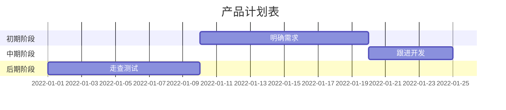

::: center
  ### 现代诗
（收集了自己比较喜欢的现代诗）
:::

::: right
  [我是右浮动的内容](https://www.baidu.com)
:::

::: details

:::center

>你不愿意种花 

>你说：  

>“我不愿看见它 一点点凋落”  

>是的  

>为了避免结束  

>您避免了一切开始 

:::

::: theorem 牛顿第一定律
假若施加于某物体的外力为零，则该物体的运动速度不变。
::: right
来自 [维基百科](https://zh.wikipedia.org/wiki/%E7%89%9B%E9%A1%BF%E8%BF%90%E5%8A%A8%E5%AE%9A%E5%BE%8B)
:::

